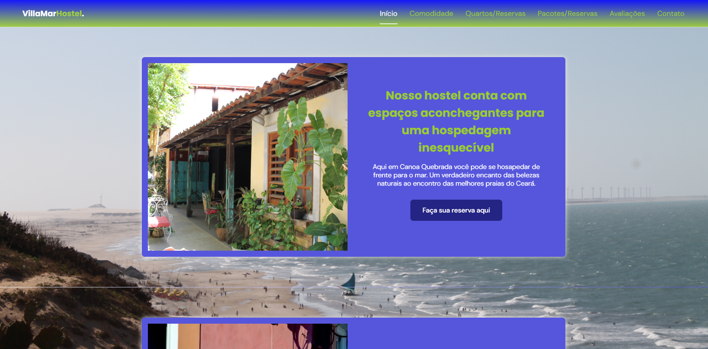
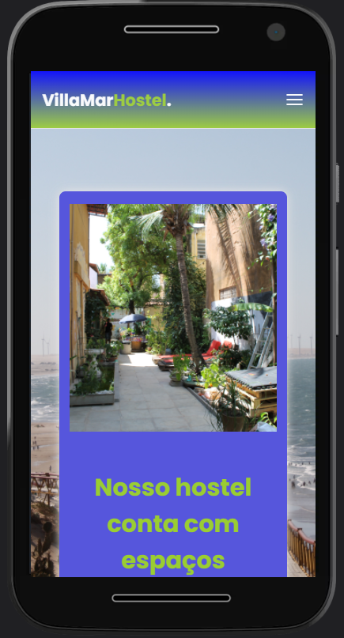

<h2 align="center">
  Villamar Hostel
</h2>
<h3 align="center">
  Tema de website desenvolvido para Hostel
</h3>

 

  

  

## 💻 Projeto
Desenvolvido com o intuito de ser uma página responsiva e servir para a criação de websites diversos.

## :rocket: ​Tecnologias

Nesse projeto utilizo-se as tecnologias:

- HTML
- CSS
- JavaScript

Bibliotecas:

* Google Fonts
* SwipeJS
* ScrollRevel

## 🔖 Layout

Projeto de website com tema voltado para hostel, e servindo de base para desenvolvimento de websites diversos.
Você pode visualizar o layout do projeto através desse link https://yan-gelsleichter.github.io/Villamar-Hostel/

